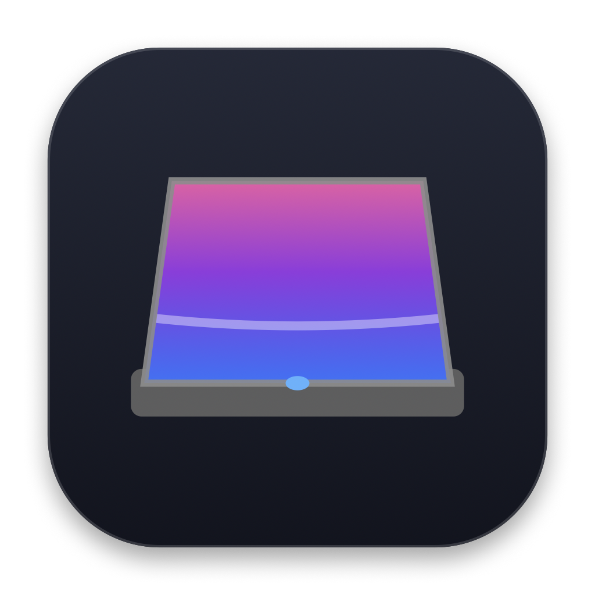

# MacHinge

<p align="center">
  
</p>

<p align="center">
  <strong>Physical MacBook Lid-Driven Display Folding Transition</strong>
</p>

<p align="center">
  <a href="#requirements"></a>
  <a href="#requirements"></a>
  <a href="#license"></a>
  <a href="#releases"></a>
</p>

---

## What It Does

**MacHinge** connects your MacBook display to its physical hinge. By reading real-time hinge angle data directly from the Apple Sensor Processing Unit (SPU), MacHinge dynamically folds and unfolds your desktop in physical sync with your lid movements.

When you close your MacBook lid, your screen smoothly curves around the hinge axis in real time using Apple Metal GPU shaders. When you open your Mac from sleep, the display smoothly unfolds back into view.

---

## Features

- **Decoupled Physical Trigger Architecture:**
  - The display remains normal, crisp, and unchanged across your entire comfortable viewing range (80° to 120°+).
  - The folding animation initiates only when the lid passes below the closing threshold (~78°).
- **Apple Silicon Hardware Sensor Integration:**
  - Reads physical hinge angle reports at approximately 50–60 Hz during physical motion via I/O Kit HID services.
- **Metal-Accelerated 3D Folding Mesh:**
  - Real-time 3D perspective, curvature deformation, ambient occlusion crease shading, and lighting effects.
  - Multiple configurable visual styles: *Luminous Glow*, *Frosted Glass*, and *Magnetic Lens*.
- **Low-Overhead Idle State:**
  - When the lid is stationary at a normal viewing angle (> 78°), active Metal rendering and screen capture pause automatically, resulting in low idle CPU usage observed during testing.
- **Instant Wake Transition:**
  - Immediate frame restoration when opening the lid from complete clamshell sleep.
- **Lightweight Menu Bar Utility:**
  - Operates quietly in the menu bar (`∠`) without taking up Dock space (`LSUIElement`).

---

## Demo

> *(A demonstration video or animation will be added here upon release)*

---

## Requirements

- **Supported macOS Versions:** macOS 14.0 (Sonoma) or later.
- **Supported Hardware:** Tested on Apple Silicon MacBooks (M1, M2, M3, and M4 series).
  - *Note:* Hardware support reflects configurations tested during development and is not guaranteed across every hardware revision or macOS build.
  - *Note:* Requires a MacBook with a built-in Apple SPU lid angle sensor.
  - *Note:* Intel Mac hardware support has not been verified.
  - *Note:* Desktop Macs (Mac Studio, Mac mini, Mac Pro, iMac) lack physical lid sensors and are unsupported.
- **Display Configuration:** Optimized for the built-in Retina MacBook display.

---

## Installation

Pre-built downloads will be published on the GitHub Releases page.

### Installing a Pre-built Release
1. [Download the latest release](#releases) (`MacHinge-0.1.0.dmg`) from GitHub Releases.
2. Open the DMG and drag **MacHinge** to your **Applications** folder.
3. Launch MacHinge from `/Applications`.
4. Grant the required Screen Recording permission when prompted.

> **Note on Notarization:** Pre-built beta binaries are ad-hoc code-signed. Because they are not currently notarized with an Apple Developer certificate, macOS Gatekeeper may prompt you on first launch. You can allow it via **System Settings > Privacy & Security** or by right-clicking the app and selecting **Open**.

---

## Building from Source

### Prerequisites
- macOS 14.0 or later
- Xcode 15+ or Xcode Command Line Tools (`xcode-select --install`)
- Swift 5.10 or Swift 6.0 toolchain

### Build via Swift Package Manager
```bash
# Clone the repository
git clone https://github.com/santhoshsunkara24/MacHinge.git
cd MacHinge

# Build executable in release mode
swift build -c release
```

### Packaging into a Standalone `.app` Bundle
To construct a signed local `.app` bundle:
```bash
./package_release.sh
```
The resulting `MacHinge.app` will be created inside the `Release/` directory.

---

## Permissions

MacHinge requests the following macOS permissions:

1. **Screen Recording (`ScreenCaptureKit`):**
   - Required to project the desktop image into an in-memory Metal texture for real-time 3D folding shaders.
   - Captured frames are processed entirely in local GPU memory and are never written to disk or recorded.
2. **Accessibility (Optional):**
   - Used solely for global hotkey toggling if enabled in Settings.

---

## Privacy

- **100% On-Device Processing:** All sensor reading, screen capture, and Metal rendering occur entirely in-memory on your local Mac.
- **No Data Storage:** Screen textures are processed in real time and are never saved to persistent storage.
- **No Network Telemetry:** MacHinge contains no network calls, analytics SDKs, trackers, or remote logging. No obvious credentials, personal paths, or network telemetry were found during this audit.

---

## Known Limitations

- **Clamshell Mode / Closed State:** When the lid is completely closed (0°), macOS puts the display subsystem to sleep.
- **External Displays:** The folding transition is specifically designed for the built-in laptop screen. Connected external monitors remain at standard desktop projection.
- **Desktop Macs:** Desktop Mac models without built-in lid sensors cannot run the sensor pipeline.

---

## Contributing

Contributions, bug reports, and suggestions are welcome!

1. Fork the repository
2. Create your feature branch (`git checkout -b feature/amazing-feature`)
3. Commit your changes (`git commit -m 'Add amazing feature'`)
4. Push to the branch (`git push origin feature/amazing-feature`)
5. Open a Pull Request

---

## License

This project is licensed under the **MIT License** — see the [LICENSE](LICENSE) file for details.

---

## Releases

Pre-built downloads, release notes, and version history will be published on the [GitHub Releases](#releases) page.
